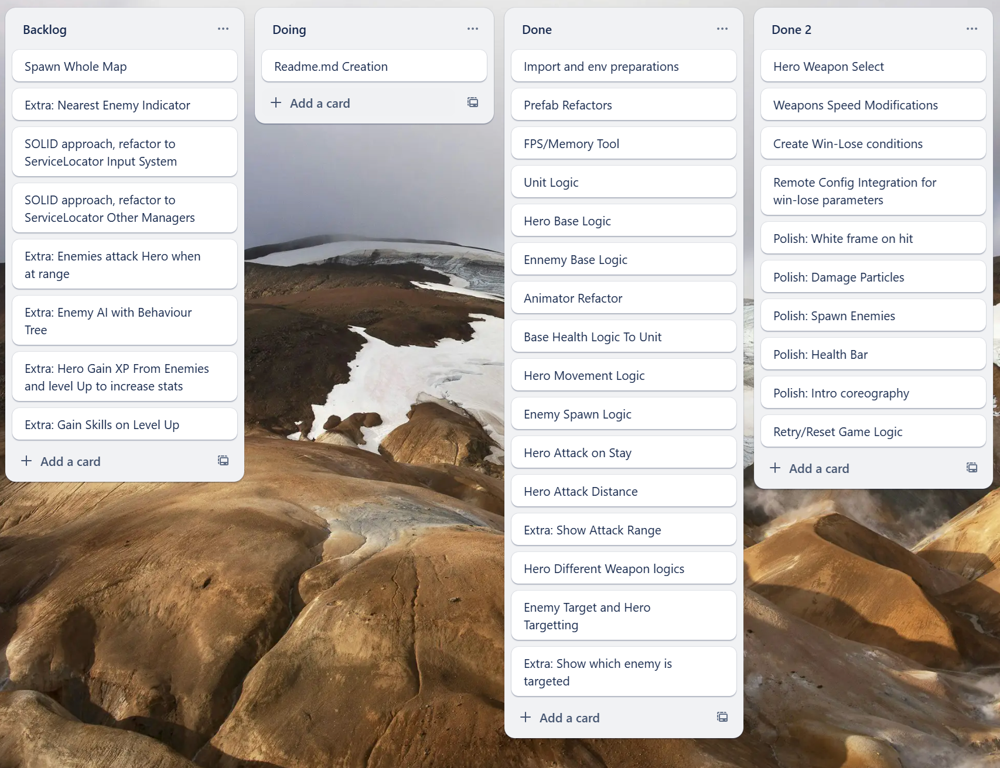

# Modma Assignment
This is the personal explanations on how I did this tech test for application into Modma Games.

## How I approached this test:
### Phase 1 - Set up
- I read the whole assignment twice, trying to understand what was required to do completely.
- I created a repository and a Trello board, in order to keep things ordered and properly prioritized.
- Search for an appropriate ART content to match any of the given theme (sky pirates) and to take a look on how things were organised in it and check if I may need some changes to work comfortably.
- Created all Trello items dividing the things to do in small pieces.

This whole phase lasted like 1h, as I could do some of those in parallel.

### Phase 2 - Customising experience
- I reordered stuff in order to feel comfortable with it, for example, I created new Game Prefabs for Hero and Enemy, making them both inherit from an Unit one.
- This allowed to make both kind of Units to have a health component, a visuals one and Rigidbody+Collider. Things that all of them will share.
- Also unified the AnimatorController State names to be the same. So the visuals component can call same states when needed and became reusable.
- Created the main scene to use the Hero prefab + make the camera work well with it.
- Add all weapons to hero and just show 1 of them at random.
- Creating a Game Manager and other required Managers to Initialize all in proper order, with Singletons.
- Added a tool to check FPS performance and memory usage.

This phase was around 2h.

### Phase 3 - Feature Development
- Add health component to unit with base events to handle hits/death.
- Make the hero move using the touch logic for the screen.
- Make enemies to spawn up to a maximum, around the hero, with some rules and using a Pool.
- Make hero detect enemies at a fixed distance and face the nearest one.
- Make the hero attack when stopped.
- Create the trigger, adding the layers for the hero/enemy in order to allow hit detection.
- Sync animations with hits.
- Create a visual representation of hitting distance.
- Create a visual representation of targeted enemy.
- Add different parameters for weapons and adapt existing code for each modification: attack range, attack speed, movement speed, damage done...
- Create buttons for selecting and changing the weapon and all the inner changes.
- Added several improvements to polish visual feedback:
    - Spawn enemies choreography.
    - White frame on hit
    - Health bar
    - Damage Particles on hit
- Create win-lose conditions.
    - Enemy count and win condition with UI
    - Time left with lose condition and UI
- Remote Config integration using Unity Services
- Retry/Reset Logic with UI.

This whole feature development took around 12h.

### Phase 4 - Landing
- Final test play on device and polish minor stuff. Device is a low-end (Android 9) Huawei P20 Lite (2018).
- Writing this document.

Landing took around 1h.

## Difficulties
I have worked in Action games like Archero for the last year and a half. I already have a trained expertise in this specific kind of games. Also have developed previously all features in this game, except for weapon selector/weapon change in-game or the remote config.  

But, as well as I have this trained skill set, I wanted to do thinks that worked well but with limited time, I had decided to go with Singletons instead of using better long-term SOLID DependencyInversion approach, in order to stick to the plan and be able to finish everything on a proper time amount.

## Improvements
Not all managers need to be a MonoBehaviour class. Also not need to be Singletons. I have created task maked as Extra to remove that and make the test be more SOLID like using a ServiceLocator tool like [Reflex Dependency Injection](https://github.com/gustavopsantos/Reflex).  

## Further Development 
- Regarding Enemies:
  - Make Enemies randomly move, pursuit and attack the player. So there is a thread to the hero other than time running out. I didn't include it because it may need a lot of readjust to current melee behaviors. In that case, having a melee weapon should be an option.
    - As a proof of knowledge of this topic, I include some references on next section so you can check. 
  - May be able to drop items (xp/health potions) on death and hero can collect them. 
  - Enemies will grow in hp and damage the more time it passes, at spawn time.
  - Create More enemies to have more variety.
- Do a more elaborate maps with hazards, like spikes or poison that can hurt or give the hero some status effect, or holes, so only flying units can go over them.
- I feel like a "Fog of war" System, similar to Age of empires one, will fit very well.
- And a long of things to make the test to feel more like Archero.  

## Other
I'm quite proud of what my team and I did and I suggest to take a look at my repo called [Planet Royale Repo](https://github.com/AlexandreAlberti/PlanetRoyale) which has a minor bug solved, or download the latest build from the [Google Play Store](https://play.google.com/store/apps/details?id=com.quicksand.planetroyale)  
You can find any other game I participated and released for [QuickSand Games](https://play.google.com/store/apps/dev?id=6383870736725209348) in my CV. The first ones have a Fog of War System, like the mentioned in previous section.
Thanks a lot for the opportunity to participate in your selection process.